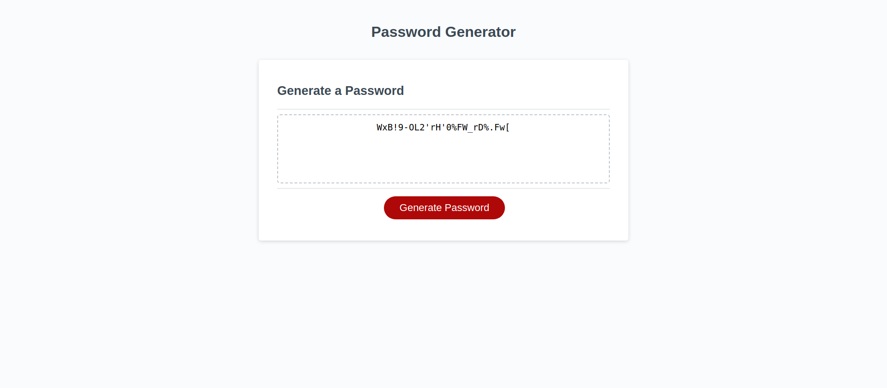

# Password-Generator-EDementieva

## Description

The task in this Challenge is to create an application that an employee can use to generate a random password based on criteria they’ve selected by modifying starter code.

I've created an app that runs in the browser and features dynamically updated HTML and CSS, all powered by JavaScript code. The app adapts to multiple screen sizes.

## Installation

N/A

## Usage of the application: 

    Generate a password when the button is clicked.

    Present a series of prompts for password criteria:

        Character types: Lowercase, Uppercase, Numeric, Special characters ($@%&*, etc.)

        Length of password: At least 10 characters but no more than 64.

        Code validates for each input and at least one character type should be selected.

        Once all prompts are answered, the password is generated and written to the page.

https://coralpeony.github.io/Password-Generator-EDementieva/

## Credits

N/A

## License

N/A